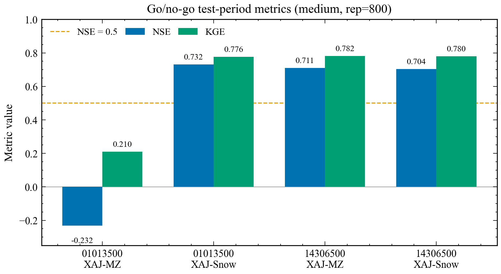
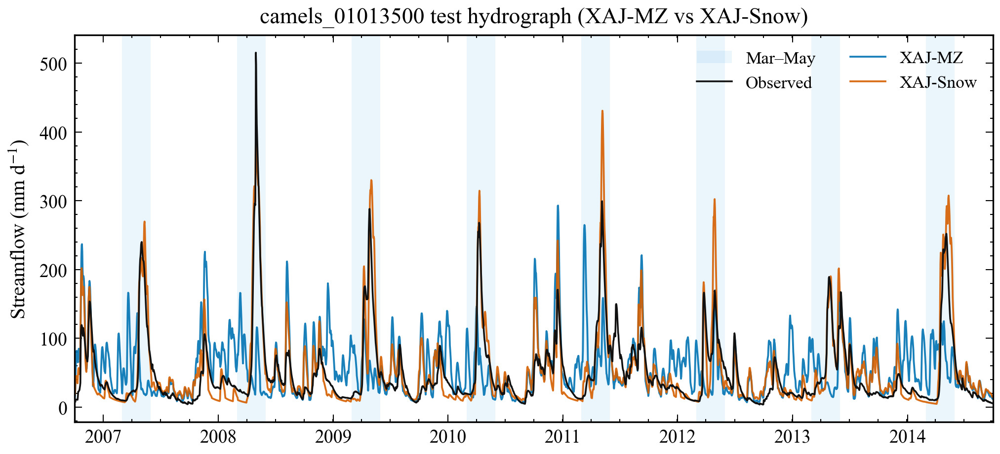
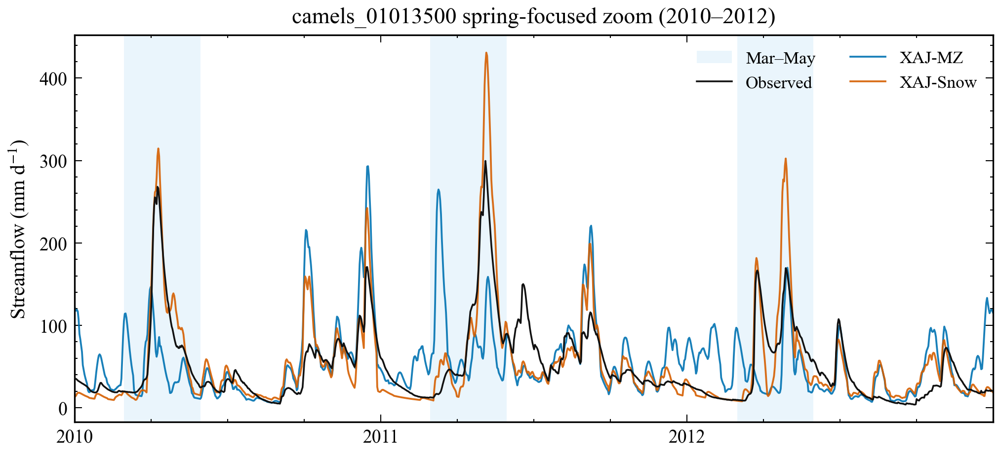
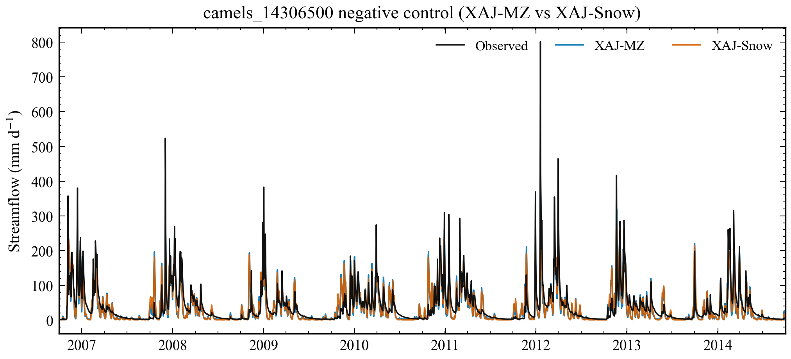
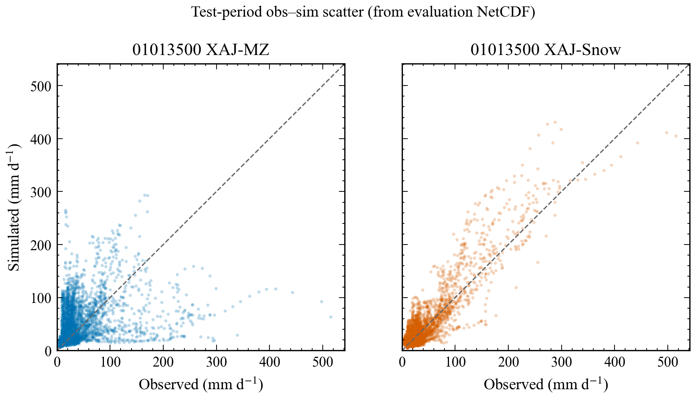

<!-- Markdown sibling of XAJ-Snow report. HTML/PDF are the fully self-contained deliverables (base64 figures + inline CSS). This Markdown keeps relative image paths for in-repo reading. -->

Hydromodel 0.3.2 · XAJ-Snow 完整科研报告 · 2026-08-16 15:01 · 仅本地研究交付

  完整科研报告 · 正式学术风格 · 自包含 HTML

# XAJ-Snow：从错误的人类活动解释到雪过程结构缺失的诊断、最小修正与工程 Go/No-Go 验证

副标题：基于 Caravan 两流域成对实验的可复现研究报告（大样本结论待补充）

项目软件：hydromodel 0.3.2　|　生成脚本：scripts/generate_publication_outputs.py　|　状态：工程 GO论文大样本待补充

交付物：results/publications/（HTML 自包含；指标来自 basins_metrics.csv）

  **目录（可点击）**

    - 执行摘要

    - 研究背景与目的

    - 研究问题与假设形成过程

    - 数据来源与数据准备

    - 方法

    - 研究过程

    - 结果展示

    - 图表超详细解释

    - 分析与讨论

    - 主要结论

    - 局限与展望

    - 软件与可复现性

    - 参考文献

    - 附录

## 1. 执行摘要

本报告记录 XAJ-Snow（在 Xin’anjiang model, XAJ 上游增加 CemaNeige-style 融雪层）的工程实现、成对率定与 go/no-go 判定。
在统一的 Shuffled Complex Evolution–University of Arizona (SCE-UA) + Kling–Gupta efficiency (KGE) 协议（rep=800）下，真实测试期指标为：

  - camels_01013500（frac_snow≈0.37）：XAJ-MZ 的 Nash–Sutcliffe efficiency (NSE)=-0.2321、KGE=0.2096；XAJ-Snow NSE=0.7318、KGE=0.7764（ΔNSE≈+0.964）。

  - camels_14306500（低雪负对照）：XAJ-MZ NSE=0.7106；XAJ-Snow NSE=0.7043（ΔNSE≈-0.006）。

  - 01013500 最优雪参：Kf≈3.50 mm/°C/day，CTG≈0.116（未贴边）。单元测试 8/8 PASS。

**判定：工程 GO。** 融雪结构假说在本成对协议下获强支持。
**边界：**不得把双流域试验外推为大样本论文主结论；分层批量、SWE（snow water equivalent）辅助一致性、优化预算/自由度因子实验等仍为“待补充”。
不得声称“首次 XAJ 融雪”。

## 2. 研究背景与目的

大样本水文显示，概念模型的“平均技巧”会掩盖特定气候/地貌区间的结构性失效（Knoben et al., 2020；Santos et al., 2025）。
雪影响流域是典型压力测试：若模型不能把降雪暂存并以融雪形式释放，春汛峰现时间与洪量会被系统性扭曲。

XAJ 已有融雪/寒区过程耦合先例（Tan et al., 2023；Ju et al., 2024；Dong et al., 2024；Wu et al., 2025），且 Chen et al.（2025）已在 CAMELS 531 流域上把 CemaNeige 接入可微参数学习的积融雪新安江（dMXAJ），中位 KGE 显著提升。
因此本文/本报告贡献不是“第一次加雪/第一次 XAJ–CemaNeige/第一次大样本 XAJ 融雪”，而是：
（1）在统一经典 SCE-UA 协议下做失效诊断；（2）用故意极简、非 ML 的双参数修正做可证伪检验；（3）用负对照约束虚假增益；（4）为后续适用边界与公平性实验铺路。
与 Chen et al.（2025）的“大样本高技巧学习器”叙事相比，本工作追问的是**何时需要最小融雪结构**；与 Wu et al.（2025）及 Dong et al.（2024）相比，强调最小修正 + 负对照，而非更完整寒区物理。

本报告目的：把本地真实实验链条（数据→代码→率定→指标→图→判定）写成可独立审阅的完整档案，并与投稿向论文初稿对齐。

## 3. 研究问题与假设形成过程

早期直觉曾把 01013500 的差表现归因于人类活动/土地利用复杂。
流域属性对照显示：人类足迹指数 hft≈30.6（010）对 34.3（143），对照流域甚至略高；干旱指数同为约 0.49。
因而“人类活动更强导致更差”缺乏支持（见 basin_alignment 诊断）。

转向结构假说：XAJ-MZ 无雪过程，降雪被当作降雨立刻参与产流 → 雪区样本外崩溃；在低雪区则不一定。
可检验预测：

  - 同一协议下，雪区 XAJ-Snow ≫ XAJ-MZ；

  - 负对照区 XAJ-Snow ≈ XAJ-MZ（无虚假大增益）；

  - 雪参 Kf、CTG 落在合理区间且不贴边。

这些预测在 medium go/no-go 中全部满足，从而形成“全速推进分层大样本”的工程决策；论文级总体结论仍待大样本。

## 4. 数据来源与数据准备

### 4.1 Caravan 与变量

数据来自 Caravan（Kratzert et al., 2023）中的 CAMELS 子集。须强调：Caravan 强迫场≠各地原始 CAMELS 强迫，可能改变概念模型表现（Clerc-Schwarzenbach et al., 2024）。
本实验使用的关键变量：降水 *P*、潜在蒸散发 PET（诊断默认 FAO Penman–Monteith）、流量 *Q*、以及 XAJ-Snow 所需的 2 m 气温 *T*（temperature_2m_mean 写入 minicache）。

### 4.2 两流域角色

| 流域 ID | 角色 | frac_snow | 面积 km² | 干旱指数 | 人类足迹 | 森林% |
| --- | --- | --- | --- | --- | --- | --- |
| camels_01013500 | 雪影响诊断目标 | 0.37 | 2298 | 0.49 | 30.6 | 88.5 |
| camels_14306500 | 低雪负对照 | ≈0 | 859 | 0.49 | 34.3 | 98.7 |

来源：results/diagnostics/basin_alignment_01013500_vs_14306500.md；训练/测试日数均为 3652 / 3287，P/E/Q NaN 比例为 0。

### 4.3 时段与质量

| 项目 | 取值 |
| --- | --- |
| 训练期 | 1985-10-01 – 1995-09-30 |
| 测试期 | 2005-10-01 – 2014-09-30 |
| warmup | 365 d |
| 缺失检查 | 两流域训/测 P·E·Q 无 NaN（对齐诊断） |
| 绘图时间轴 | 评价 NetCDF 中 warmup 后的测试窗（约 2006-10-01 至 2014-09-30） |

## 5. 方法

### 5.1 XAJ-MZ

Xin’anjiang model（新安江模型）的 hydromodel 实现，配合 Muskingum–Zhao 汇流，15 个率定参数，无雪蓄变量。全部降水按液态输入产流模块。

### 5.2 CemaNeige-style 融雪层与符号

XAJ-Snow 在 XAJ-MZ 前增加集总单带度日融雪层（Valéry et al., 2014；非严格 airGR 复现）。
固定 Ts=0°C、Tr=1°C。自由参数：

  - Kf：度日因子（mm °C−1 d−1），越大则同等正温下融雪越快；搜索 [0,10]。

  - CTG：冷含量/热状态惯性 [-]，∈[0,1]；越大则对既往寒冷记忆越强、融雪启动越滞后。

符号：P 降水，T 气温，G 热状态，MeltPot 潜在融雪，Gratio 雪盖因子，M 融雪，SWE 雪水当量。质量守恒要求雨+雪=P（分割后），融雪不超过 SWE。

rain, snow ← partition(P, T; Ts, Tr)

SWE ← SWE + snow；G ← min(0, CTG·G + (1−CTG)·T)

仅当等温（G≈0）时 MeltPot ← min(SWE, max(0, Kf·T))；否则 MeltPot=0

Gratio ← min(1, SWE/Gthreshold)；M ← min(SWE, (0.9·Gratio+0.1)·MeltPot)

NSE/KGE 越接近 1 越好；NSE<0 表示不如用观测均值作预报。本实验主目标函数为训练期 KGE，报告测试期 NSE 与 KGE。
Kf≈3.5 落在文献常见度日量级（约 2–6）且未贴边，但在无 SWE 约束时仍是**有效参数**而非独立物理辨识。

### 5.3 率定协议

算法 SCE-UA（spotpy），目标 KGE；两模型两流域均用 medium 设置 `rep`=800、`ngs`=15（成对可比）。
**注意：**匹配预算≠已证明收敛公平；更高 rep、多种子、固定雪参消融等仍为“待补充”，不得把 rep=800 写成充分公平基线。
smoke 曾用 rep=120 仅验证流水线。可选 scipy NSE 精修配置已存在但**尚未运行**（待补充）。

### 5.4 模型结构对比

| 项目 | XAJ-MZ | XAJ-Snow |
| --- | --- | --- |
| 雪过程 | 无 | 单带 CemaNeige-style |
| 输入特征 | P, PET | P, PET, T |
| 参数个数 | 15 | 17（+Kf,+CTG） |
| 核心产汇流 | XAJ-MZ | 同左（融雪后调用） |

## 6. 研究过程

  - 属性诊断否定纯人类活动解释；提出雪过程结构缺失假说。

  - 工程修复：minicache 写入气温；数据加载 VAR_MAPPING；InvalidIndexError 等相关修复见 diagnostics。

  - 实现 snow.py / xaj_snow.py 并注册模型；单元测试 8/8。

  - smoke（rep=120）验证 pipeline：010 snow NSE 已升至约 0.436。

  - medium（rep=800）正式 go/no-go：雪区大幅提升、负对照中性。

  - SciencePlots 出图；本脚本汇总为正式报告与论文初稿。

| 研究问题 | 证据 | 当前状态 |
| --- | --- | --- |
| 雪区是否因无融雪而失效？ | 010 ΔNSE≈+0.96；过程线春峰改善 | 成对协议下支持 |
| 是否到处虚假增益？ | 143 ΔNSE≈−0.006 | 单对照支持中性 |
| 大样本适用边界？ | — | 待补充：分层批量 |
| SWE 状态一致性？ | — | 待补充 |
| 优化预算/自由度公平性？ | — | 待补充 factorial |

## 7. 结果展示

**表：成对测试期指标（真实 CSV）**

| 流域 | 模型 | NSE | KGE | RMSE | Bias | Corr |
| --- | --- | --- | --- | --- | --- | --- |
| 01013500 | XAJ-MZ | -0.2321 | 0.2096 | 2.2446 | 0.2776 | 0.2550 |
| 01013500 | XAJ-Snow | 0.7318 | 0.7764 | 1.0473 | 0.1665 | 0.9031 |
| 14306500 | XAJ-MZ | 0.7106 | 0.7815 | 3.0565 | -0.3755 | 0.8461 |
| 14306500 | XAJ-Snow | 0.7043 | 0.7795 | 3.0895 | -0.2792 | 0.8410 |

数据来源：results/xaj_snow_go_nogo/.../evaluation_test/basins_metrics.csv；协议 SCE-UA+KGE，rep=800；训练 1985-10-01–1995-09-30；测试 2005-10-01–2014-09-30；warmup=365。

| 流域 | Kf | CTG | 备注 |
| --- | --- | --- | --- |
| 01013500 | 3.5006 | 0.115624 | 主诊断；未贴边 |
| 14306500 | 6.2574 | 0.705998 | 负对照；无雪时参数可退化/欠约束 |

参数来源：basins_denorm_params.csv

  **图 1.** Go/no-go 成对样本外 NSE 与 KGE 柱状对比.
  Data source: basins_metrics.csv under results/xaj_snow_go_nogo/*/evaluation_test/.

#### 图 1 超详细解读（来龙去脉）

**背景与目的：**在推进大样本之前，需要一张“成对协议下谁赢、赢多少”的总览图，把四个实验（两流域×两模型）的样本外技巧摆在同一坐标上，避免口头比较。

**全篇作用：**它是 go/no-go 的定量门闩：雪区必须明显提升，负对照不能出现虚假大增益。

**如何阅读：**横轴是流域；每组柱对应 NSE 与 KGE。颜色区分指标族，同一指标下再对比 XAJ-MZ 与 XAJ-Snow。数值越高越好（NSE/KGE 上限为 1）。

**可看出：**01013500 上 XAJ-Snow 柱显著高于 XAJ-MZ（NSE 由负转正）；14306500 两模型几乎等高。

**不能看出：**不能外推到“全球都需要加雪”；不能区分提升来自结构还是仅仅多了两个参数的优化运气（需后续公平性实验）。

**通俗解释：**像考试成绩单：有雪的流域“补课后成绩飞跃”；几乎没雪的对照班“补课前后差不多”，说明不是随便补课都能涨分。

  **图 2.** 雪影响流域 01013500 全测试期水文过程线.
  Data source: xaj_*_evaluation_results.nc (test window after warmup).

#### 图 2 超详细解读（来龙去脉）

**背景与目的：**指标只给一个分数；过程线展示“错在什么季节、错成什么形状”。

**全篇作用：**把“无融雪→降雪当雨立刻产流”的机制假说落到可看见的春汛峰值上。

**如何阅读：**横轴为测试期日期（warmup 之后），纵轴为流量。黑线=观测，蓝线=XAJ-MZ，橙线=XAJ-Snow；浅色条带≈3–5 月融雪季。

**可看出：**春季峰值时机与量级上，橙线更贴近黑线；蓝线常偏早/偏肥或错峰。

**不能看出：**单靠过程线不能证明 SWE 模拟正确；夏秋季残差也可能来自土壤/汇流参数权衡。

**通俗解释：**把河流当“蓄水罐出水”。没雪模块时，冬天的“固态水”被当成立刻可流走的雨；有雪模块后，水先存再化，春天洪峰才对得上。

  **图 3.** 01013500 春季放大过程线（2010–2012）.
  Data source: same NetCDF as Fig. 2; Mar–May spring shading.

#### 图 3 超详细解读（来龙去脉）

**背景与目的：**全时段图信息密度高，春季细节被压缩；放大 2010–2012 连续融雪季以便审稿式细读。

**全篇作用：**检查提升是否来自“一两个偶然大洪水”，还是跨年可重复的季节性修正。

**如何阅读：**同图 2 的颜色语义；聚焦每个春季多峰结构、起涨点与退水坡。

**可看出：**连续年份中 XAJ-Snow 对春峰更稳定地贴合观测。

**不能看出：**无法分离气温强迫误差与融雪结构误差；也不能推广到未绘制的其他年份以外的统计总体。

**通俗解释：**把三年春天的录像慢放，看“开化放水”的节奏是否被模型学会，而不是只看全年总分。

  **图 4.** 低雪负对照流域 14306500 水文过程线.
  Data source: xaj_*_evaluation_results.nc for camels_14306500.

#### 图 4 超详细解读（来龙去脉）

**背景与目的：**负对照流域几乎无雪，用来回答“多两个参数会不会到处涨分”。

**全篇作用：**支撑“选择性增益”叙事，防止把 XAJ-Snow 写成万能补丁。

**如何阅读：**若蓝/橙过程线高度重叠，且与表中 ΔNSE≈0 一致，则对照成立。

**可看出：**两模型过程线接近，指标几乎不变（甚至略降）。

**不能看出：**不能证明一切无雪流域都中性——目前只有一个对照；分层大样本后才能给置信区间。

**通俗解释：**给不需要羽绒服的地方也发一件羽绒服：如果成绩不变，说明衣服不是“作弊神器”，而是对症工具。

  **图 5.** 01013500 观测–模拟散点图.
  Data source: paired daily Q from evaluation NetCDF.

#### 图 5 超详细解读（来龙去脉）

**背景与目的：**散点图压缩时间维，突出误差幅度与相关结构。

**全篇作用：**与 NSE/KGE/RMSE 数字互证：点云更贴 1:1 线 ↔ 更高相关、更低误差。

**如何阅读：**横轴观测、纵轴模拟；1:1 线为完美一致。点越散、越偏，技巧越差。

**可看出：**XAJ-Snow 点云更收敛；XAJ-MZ 更分散且偏离。

**不能看出：**看不出洪峰迟到还是早到（需过程线）；也看不出季节分层误差。

**通俗解释：**像打靶：橙点更靠近靶心对角线，蓝点更“散弹”。

## 8. 图表超详细解释（汇总说明）

上一节已对图 1–5 逐图给出“背景—读法—能看出/不能看出—通俗解释”。
子图若在单张 PNG 内以多面板出现，读图时仍按颜色语义（黑=观测，蓝=XAJ-MZ，橙=XAJ-Snow）与指标柱组对照。
本报告**不新造**无数据支撑的示意图。

## 9. 分析与讨论

**机制：**雪区增益与春峰改善同向，符合“降雪被当雨”的结构缺陷叙事；负对照中性降低“纯参数个数涨分”嫌疑，但尚未被 factorial 终证。
**与文献：**相对 Tan/Ju/Dong/Wu，尤其相对 Chen et al.（2025，CAMELS 531 流域 dMXAJ+CemaNeige），我们强调诊断—最小修正—负对照—边界，而非宣称首次融雪 XAJ、首次 XAJ–CemaNeige 或首次大样本 XAJ 融雪。
Chen et al.（2025）已证明大样本上加 CemaNeige/可微学习可抬高中位技巧；本工作若完成分层样本，应回答“何时最小融雪结构成为必要”，而不是重复“加雪能涨分”。
**替代解释：**Caravan 强迫偏差、PET 选择、单带气温代表性、土壤参数吞掉雪误差、未观测到的水库调节等仍开放。

## 10. 主要结论

  - 在成对 SCE-UA+KGE（rep=800）协议下，XAJ-Snow 使 01013500 测试 NSE 从 -0.232 提升至 0.732，KGE 从 0.210 至 0.776。

  - 负对照 14306500 上技巧基本不变（ΔNSE≈-0.006），支持选择性增益。

  - 工程上判定 GO，可进入分层大样本；科学上尚不能给出全球/多区域适用边界终结论。

## 11. 局限与展望

**待补充实验矩阵**

| 实验 | 目的 | 状态 |
| --- | --- | --- |
| 分层 0/低/中/高雪批量率定 | RQ1–RQ2 总体推断 | 未完成（仅有抽样脚本骨架） |
| ERA5-Land SWE 辅助一致性 | 状态约束，非独立验证 | 未完成 |
| 优化预算倍数 × seeds | 公平性 | 未完成 |
| 固定雪参 vs 自由雪参 | 额外自由度 | 未完成 |
| scipy NSE refine | 补充展示 | 配置有，未跑 |
| 属性→ΔKGE 适用边界 | RQ3 | 未完成 |
| optimizer×sharing factorial | 归因分离 | 可选，未做则不出图 |

实现局限：单高程带；Ts/Tr 固定；Gthreshold 由当前序列估计；17 vs 15 参数。

## 12. 软件与可复现性

cd d:\Projects\hydromodel-0.3.2\hydromodel-0.3.2
$env:HOME = (Get-Location).Path
$env:HYDRO_SETTING_FILE = Join-Path $env:HOME "hydro_setting.yml"
python -m pytest test/test_snow.py -v
.\RUN_GO_NOGO_XAJ_SNOW.ps1 smoke
.\RUN_GO_NOGO_XAJ_SNOW.ps1 medium
python scripts/generate_publication_outputs.py

关键源码：hydromodel/models/snow.py, xaj_snow.py, xaj.py, model_config.py。本脚本不修改模型计算逻辑。

## 13. 参考文献

仅纳入本地已核验 DOI（docs/local/literature_review_xaj_snow.md）。

- Clerc-Schwarzenbach, F., et al.: Technical note: How many times can you afford to change hydrologic forcing? HESS, 28, 4219–4235, https://doi.org/10.5194/hess-28-4219-2024, 2024.
- Chen, Z., Zhao, T., et al.: Incorporating snow accumulation and melting into the Xin’anjiang model using differentiable parameter learning (dMXAJ / CemaNeige; 531 CAMELS catchments). Advances in Water Science, https://doi.org/10.14042/j.cnki.32.1309.2025.02.003, 2025.
- Dong, N., Wang, H., Yang, M., Zhang, J., and Xu, S.: An improved Xin’anjiang model with snow melting and soil freeze–thaw processes (Upper Yalongjiang). Advances in Water Science, https://doi.org/10.14042/j.cnki.32.1309.2024.04.002, 2024.
- Husic, A., Hammond, J., Price, A. N., and Roundy, J. K.: Interrogating process deficiencies in large-scale hydrologic models with interpretable machine learning. HESS, 29, 4457–4472, https://doi.org/10.5194/hess-29-4457-2025, 2025.
- Ju, J., et al.: Application of distributed Xin’anjiang model of melting ice and snow in Bahe River basin (DD-XAJ). Journal of Hydrology: Regional Studies, 42, 101638, https://doi.org/10.1016/j.ejrh.2023.101638, 2024.
- Ke, H., et al.: Xinanjiang-based interval forecasting model for daily streamflow considering climate change impacts (with snowmelt module). Water Resources Management, https://doi.org/10.1007/s11269-024-03909-6, 2024.
- Knoben, W. J. M., et al.: A quantitative assessment of 36 conceptual rainfall–runoff models across 559 catchments. WRR, https://doi.org/10.1029/2019WR025975, 2020.
- Kratzert, F., et al.: Caravan — A global community dataset for large-sample hydrology. Scientific Data, https://doi.org/10.1038/s41597-023-01975-w, 2023.
- Ouyang, W., et al.: Continental-scale streamflow modeling with LSTM under reservoir influences. Journal of Hydrology, https://doi.org/10.1016/j.jhydrol.2021.126455, 2021.
- Ouyang, W., et al.: Differentiable Xinanjiang models (dXAJ / dXAJnn). Journal of Hydrology, https://doi.org/10.1016/j.jhydrol.2024.132471, 2024.
- Premier, V., et al.: Isolating snowmelt-coefficient effects by fixing remaining parameters. HESS, https://doi.org/10.5194/hess-30-1189-2026, 2026.
- Ruelland, D.: SIAR and parsimonious snow accounting under limited degrees of freedom. Journal of Hydrology, https://doi.org/10.1016/j.jhydrol.2023.129867, 2023.
- Ruelland, D.: Snow data improve consistency and robustness of semi-distributed models. Journal of Hydrology, https://doi.org/10.1016/j.jhydrol.2024.130820, 2024.
- Santos, L., Andréassian, V., Sonnenborg, T. O., Lindström, G., de Lavenne, A., Perrin, C., Collet, L., and Thirel, G.: Lack of robustness of hydrological models: a large-sample diagnosis and an attempt to identify hydrological and climatic drivers. HESS, 29, 683–700, https://doi.org/10.5194/hess-29-683-2025, 2025.
- Tan, Q., et al.: Coupling snowmelt with XAJ and SCE-UA calibration in northwestern basins. Water, 15, 3401, https://doi.org/10.3390/w15193401, 2023.
- Tong, R., et al.: Multi-objective calibration with satellite snow cover and soil moisture. HESS, https://doi.org/10.5194/hess-26-1779-2022, 2022.
- Valéry, A., Andréassian, V., and Perrin, C.: As simple as possible but not simpler (Part 1). Journal of Hydrology, https://doi.org/10.1016/j.jhydrol.2014.04.059, 2014.
- Valéry, A., Andréassian, V., and Perrin, C.: As simple as possible but not simpler (Part 2): CemaNeige. Journal of Hydrology, https://doi.org/10.1016/j.jhydrol.2014.04.058, 2014.
- Wu, N., Zhang, K., Naghibi, A., Hashemi, H., Ning, Z., Zhang, Q., Yi, X., Wang, H., Liu, W., Gao, W., and Jarsjö, J.: Predicting snow cover and frozen ground impacts on large basin runoff: developing appropriate model complexity (GXAJ / GXAJ-S / GXAJ-S-SF). HESS, 29, 3703–3725, https://doi.org/10.5194/hess-29-3703-2025, 2025.
- Yeste, P., García-Valdecasas Ojeda, M., Gámiz-Fortis, S. R., Castro-Díez, Y., Bronstert, A., and Esteban-Parra, M. J.: A large-sample modelling approach towards integrating streamflow and evaporation data for the Spanish catchments. HESS, 28, 5331–5352, https://doi.org/10.5194/hess-28-5331-2024, 2024.

## 14. 附录

### A. 术语表

| 术语 | 全称/含义 |
| --- | --- |
| XAJ | Xin’anjiang model，新安江模型 |
| XAJ-MZ | XAJ + Muskingum–Zhao 汇流，无雪 |
| XAJ-Snow | XAJ-MZ + CemaNeige-style 融雪层 |
| NSE | Nash–Sutcliffe efficiency |
| KGE | Kling–Gupta efficiency |
| SCE-UA | Shuffled Complex Evolution–University of Arizona |
| PET | potential evapotranspiration，潜在蒸散发 |
| SWE | snow water equivalent，雪水当量 |
| Kf | 度日融雪因子 |
| CTG | 冷含量系数 |
| P, T, G, M | 降水、气温、热状态、融雪 |

### B. 文件清单（成果）

  - results/publications/xaj_snow_manuscript.html\|.md\|.pdf

  - results/publications/report.html\|.md\|.pdf

### C. 审计状态

  - 指标与 CSV 一致（脚本启动时 assert）

  - HTML 图片均为 data URI；CSS 内联；无 CDN

  - Git：仅本地，未 commit/push/PR（按用户要求）

生成时间 2026-08-16 15:01。数字来自真实 evaluation CSV；待补充项已显式标注。
