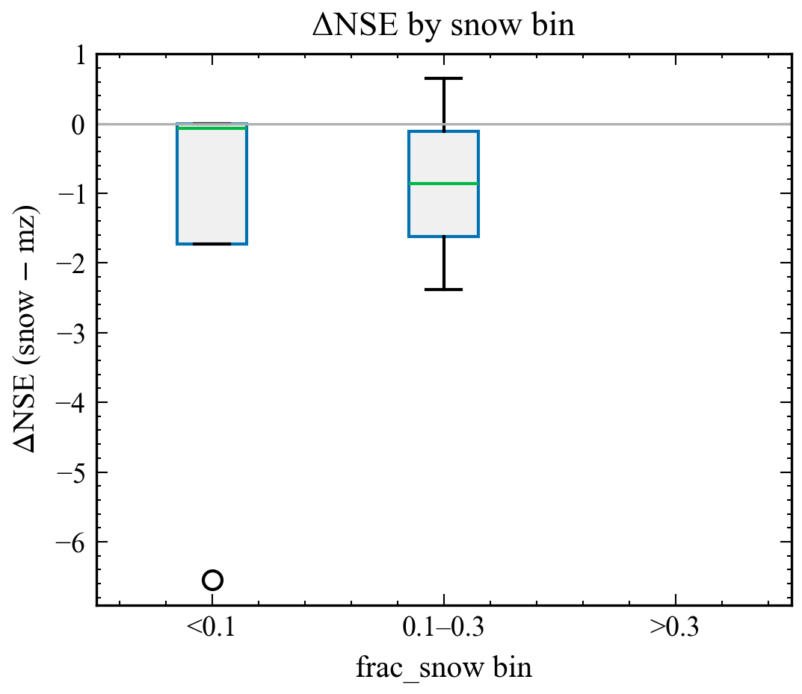

<!-- Markdown sibling of XAJ-Snow manuscript. HTML/PDF are the fully self-contained deliverables (base64 figures + inline CSS). This Markdown keeps relative image paths for in-repo reading. -->

Hydromodel 0.3.2 · XAJ-Snow manuscript draft · generated 2026-08-18 05:26 · for HESS-oriented polishing

  Manuscript draft · Hydrology and Earth System Sciences (target)

# Diagnosing snow-related structural limitations of the Xinanjiang model: a parsimonious snow extension, a paired pilot evaluation, and an exploratory multi-basin screening

Working title (avoid “global / first” until the frozen stratified sample is fully calibrated). Status: pilot complete screening batch complete large-sample pending

Authors: *to be completed* · Affiliations: *to be completed* · Correspondence: *to be completed*

Software context: hydromodel v0.3.2; model names XAJ-MZ and XAJ-Snow; Caravan CAMELS subsets.

  **Contents**

    - Abstract

    - 1 Introduction

    - 2 Data and methods

    - 3 Results

    - 4 Discussion

    - 5 Conclusions

    - Code and data availability

    - Author contributions / Competing interests / Acknowledgements

    - References

    - Supplementary note on pilot figures and objective sensitivity

## Abstract

Conceptual rainfall–runoff models remain central to large-sample hydrology, yet their structural adequacy can collapse in regimes that they do not represent.
The Xin’anjiang model (XAJ) in its Muskingum–Zhao routing form (XAJ-MZ) treats precipitation as liquid input and therefore cannot store snowfall or release meltwater.
Regional studies have already coupled snow and related cold-region processes to XAJ (Tan et al., 2023; Ju et al., 2024; Dong et al., 2024; Wu et al., 2025).
A large-sample CAMELS study has also coupled CemaNeige to XAJ under differentiable parameter learning across 531 catchments (Chen et al., 2025).
What remains under-documented in the HESS-facing literature is a diagnosis-first protocol that (i) maps *where* unmodified XAJ-MZ fails along snow/hydroclimate gradients, (ii) tests a deliberately minimal non-ML snow correction under matched nominal calibration budgets, (iii) requires neutrality on snow-free controls, and (iv) designs—rather than yet establishes—an applicability-domain estimate with fairness checks, instead of proposing another high-performing XAJ–snow family.

Here, we implement XAJ-Snow, a single-band, CemaNeige-style degree-day layer with two free parameters—degree-day factor *K*f (mm °C−1 d−1) and cold-content coefficient CTG [-]—placed upstream of an otherwise unchanged XAJ-MZ core.
We report a pilot evaluation using identical Shuffled Complex Evolution–University of Arizona (SCE-UA) calibration against the Kling–Gupta efficiency (KGE), with a matched medium budget (`rep`=800, `ngs`=15).
On snow-affected basin 01013500 (fraction of precipitation falling as snow ≈ 0.37), out-of-sample Nash–Sutcliffe efficiency (NSE) rises from -0.232 (XAJ-MZ) to 0.732 (XAJ-Snow), while KGE rises from 0.210 to 0.776.
On low-snow negative-control basin 14306500, NSE changes only from 0.711 to 0.704 (Δ ≈ -0.006).
Calibrated snow parameters on 01013500 remain interior to their search ranges (*K*f ≈ 3.50, CTG ≈ 0.116), although interiority alone does not identify a physical melt coefficient without SWE constraints.
An exploratory paired batch of 14 CAMELS basins at a lighter budget (`rep`=200) yields median ΔNSE ≈ 0.55 for snow-affected basins (frac_snow ≥ 0.1, n=9) and ≈ -0.007 for low-snow basins (n=5).

**Pending (do not treat as completed Results):** full calibration of the frozen stratified sample (currently 80 basins frozen; longer-term target ~500); snow-water-equivalent (SWE) auxiliary consistency; complete optimizer-budget / parameter-freedom factorial (including `rep`=5000 and multi-seed; only a partial `rep`=2000 check on 01013500 is available); cross-region applicability regression. Until those experiments finish, do not extrapolate to a global claim.

## 1 Introduction

Large-sample evaluations have shown that “average skill” hides regime-dependent structural failure
(Knoben et al., 2020; Santos et al., 2025).
Snow-affected catchments are a recurring stress test: models that cannot partition precipitation into rain and snow, or cannot delay melt, can misrepresent seasonal storage and runoff timing even when annual water balance looks plausible.

The Xin’anjiang model is widely used in humid and semi-humid settings.
Existing variants include coupled snowmelt–XAJ applications (Tan et al., 2023; Ke et al., 2024), distributed degree-day XAJ with ice/snow melt (Ju et al., 2024), and conceptual XAJ with snowmelt plus soil freeze–thaw (Dong et al., 2024).
Other developments include the graded-complexity GXAJ-S / GXAJ-S-SF formulation with SNOW17 (Wu et al., 2025) and a CAMELS-scale (531 basins) differentiable XAJ–CemaNeige system (dMXAJ) with local and regional parameter learning (Chen et al., 2025).
Differentiable XAJ formulations further explore optimizer and parameter-sharing design (Ouyang et al., 2025).
More broadly, coupling established snow routines to parsimonious conceptual models is now routine methodology in multi-catchment HESS-facing work (Muñoz-Castro et al., 2026).
Event-type diagnostics already isolate snow-related process limitations at large scale (Wang et al., 2026), and large-sample studies already relate conceptual-model adequacy to the fraction of precipitation falling as snow (Liu et al., 2025; Bohl et al., 2026).
**This manuscript does not claim the first XAJ snow extension, nor the first XAJ–CemaNeige coupling, nor the first large-sample XAJ–snow evaluation.**

These studies demonstrate the value of representing snow processes and, increasingly, of controlling model complexity, but they leave a narrower model-evaluation question unresolved: *when* does adding a minimal snow process to an otherwise unchanged XAJ formulation provide evidence of correcting a process deficiency rather than simply increasing model flexibility?
Addressing this question requires paired evaluation across a snow gradient, comparable calibration effort, and a specificity check in catchments where snow processes should exert little influence.
Rather than proposing a new snow formulation, this study therefore examines when an established, parsimonious snow representation is warranted within the XAJ-MZ framework.
We formulate a diagnosis-first protocol in which the baseline and snow-enabled models retain the same rainfall–runoff and routing backbone, are calibrated under controlled computational budgets, and are evaluated jointly against snow-influenced basins and snow-poor negative controls.
The planned large-sample analysis is designed to relate the paired model response to catchment snow exposure, test whether apparent discharge gains are accompanied by consistent snow behavior, and assess their robustness to calibration-fairness choices
(Valéry et al., 2014a,b; Premier et al., 2026; Husic et al., 2025; Santos et al., 2025).
The current 14-basin experiment is treated only as preliminary screening evidence motivating completion of the planned multi-basin assessment, rather than as evidence for a general applicability threshold.
Relative to the studies above—whether they demonstrate XAJ–snow skill (Tan et al., 2023; Chen et al., 2025), deepen cold-region process complexity (Ju et al., 2024; Dong et al., 2024; Wu et al., 2025), or diagnose model limitations across large samples (Wang et al., 2026; Liu et al., 2025; Bohl et al., 2026)—the distinctive element here is a controlled *intervention* experiment.
The same backbone is evaluated with and without one specific snow process, using snow-poor basins as explicit negative controls and matched calibration effort.

Research questions guiding the full study:

  - RQ1 — Where does XAJ-MZ fail out of sample as a function of snow influence and related attributes?

  - RQ2 — Does a two-parameter, single-band CemaNeige-style layer selectively improve snow-affected basins while remaining neutral on negative controls, where neutrality is defined prospectively (Section 2.5) rather than chosen after seeing the results?

  - RQ3 — Are the paired gains robust to optimizer budget and to the two extra parameters (multi-seed runs and fixed-snow-parameter ablations)?

  - RQ4 — Can an applicability domain be estimated as a continuous relationship with uncertainty from catchment attributes?

The present draft reports the pilot used to motivate stratified sampling, together with a cautious preliminary multi-basin screen at reduced calibration budget.
Full answers to RQ1–RQ4 on the frozen stratified sample remain incomplete.

## 2 Data and methods

### 2.1 Caravan data and basin sampling

Forcing and discharge come from the Caravan community dataset (Kratzert et al., 2023).
Caravan harmonizes multi-source CAMELS-family basins but its meteorological forcing is not identical to the original CAMELS products; this difference can change conceptual-model skill and must be stated explicitly (Clerc-Schwarzenbach et al., 2024).
Potential evapotranspiration (PET) uses the FAO Penman–Monteith forcing series supplied with Caravan (from version 1.5), derived from ERA5-Land meteorological variables, because the original ERA5-Land potential-evaporation series contains unrealistically high values in many basins (Clerc-Schwarzenbach et al., 2024).

The snow-exposure covariate `frac_snow` is the basin-level fraction of precipitation falling as snow, taken from the Caravan basin attribute tables provided for each region.
It is a catchment attribute, not a model output.
All basins are drawn from a reproducible stratified design over seven Caravan regions (camels, camelsaus, camelsbr, camelscl, camelsgb, hysets, lamah), using snow bin × aridity bin × regulation bin strata (3×3×2) frozen at seed 20260816.
Snow bins use frac_snow thresholds <0.1, 0.1–0.3, and >0.3; aridity bins use FAO Penman–Monteith aridity thresholds <0.75, 0.75–1.25, and ≥1.25; regulation bins use degree-of-regulation thresholds <0.1 and ≥0.1.
The frozen first batch contains 80 basins, and the paper-scale target is ~500; the full frozen list, attributes, stratum assignments, and design manifest are published in the repository diagnostics.

Two pilot basins had fixed roles assigned a priori.
A separate 14-basin CAMELS (US) screening subset (batch1), consisting of the two pilot basins plus 12 CAMELS basins from the frozen stratified sample, was used for preliminary screening; the full basin list and attributes are published in the repository diagnostics.
The snow bins S0 (frac_snow < 0.1), S1 (0.1–0.3), and S2 (> 0.3) are defined here in Methods and used consistently in Results.

| Basin | Role | frac_snow | Area (km²) | Aridity (FAO-PM) | Human footprint |
| --- | --- | --- | --- | --- | --- |
| camels_01013500 | Snow-affected diagnosis target | ≈0.37 | 2298 | 0.49 | 30.6 |
| camels_14306500 | Low-snow negative control | ≈0.0 | 859 | 0.49 | 34.3 |

Catchment attributes from the Caravan attribute table used in the public diagnostic note for this basin pair. Attributes are listed for context; their interpretive use is deferred to the Discussion.

Periods (identical for both models and both basins): training 1985-10-01–1995-09-30; testing 2005-10-01–2014-09-30; warmup length 365 days.
Daily variables: precipitation *P*, PET, discharge *Q*, and for XAJ-Snow also 2 m air temperature *T*.

### 2.2 XAJ-MZ baseline

XAJ-MZ denotes the hydromodel implementation of Xin’anjiang with Muskingum–Zhao routing and fifteen calibrated parameters (no snow store).
All precipitation enters the production module as rainfall-equivalent forcing.
XAJ-Snow shares this backbone exactly and adds only the two snow parameters described below, for seventeen total.
The same fifteen base parameters are calibrated for both models under identical search ranges (Table 1).

**Table 1.** Calibrated parameter search ranges (identical for XAJ-MZ and XAJ-Snow; XAJ-Snow adds Kf and CTG).

| Parameter | Role | Range |
| --- | --- | --- |
| K | PET ratio to reference crop evaporation | [0.1, 1.0] |
| B | Exponent of tension water capacity curve | [0.1, 0.4] |
| IM | Impervious area fraction | [0.01, 0.1] |
| UM, LM, DM | Tension water capacity: upper / lower / deep (mm) | [0, 20] / [60, 90] / [60, 120] |
| C | Deep evapotranspiration coefficient | [0, 0.2] |
| SM, EX | Mean free-water storage (mm); curve exponent | [1, 100] / [1.0, 1.5] |
| KI, KG | Interflow / groundwater outflow coefficients | [0, 0.7] each |
| A, THETA | mizuRoute channel parameters | [0, 2.9] / [0, 6.5] |
| CI, CG | Recession constants: lower interflow / groundwater | [0, 0.9] / [0.98, 0.998] |
| Kf | Degree-day melt factor (mm °C−1 d−1) — XAJ-Snow only | [0, 10] |
| CTG | Snow thermal-state weight [-] — XAJ-Snow only | [0, 1] |

### 2.3 XAJ-Snow: CemaNeige-style single-band layer

XAJ-Snow places a lumped, one-elevation-band snow-accounting module inspired by CemaNeige (Valéry et al., 2014b) and related airGR documentation upstream of the XAJ-MZ core.
The same XAJ-MZ core then receives effective liquid input (rain + melt).
Fixed thresholds in this implementation are the rain/snow threshold *T*s = 0 °C and linear mix half-width *T*r = 1 °C.
The free snow parameters are:

  - Kf — degree-day melt factor (mm °C−1 d−1), search range [0, 10]; larger values melt faster for a given positive temperature.

  - CTG — dimensionless cold-content / thermal-state inertia in [0, 1]; larger CTG increases memory of prior cold conditions and delays melt onset.

Mass symbols used in the module are precipitation *P*, temperature *T*, snow water equivalent SWE, thermal state *G*, melt potential MeltPot, snow-cover factor Gratio, and melt *M*.
The daily update is implemented exactly as follows. Rain/snow partition is a linear band:

fsnow = clip( (*T*s + *T*r − *T*) / (2 *T*r), 0, 1);  snow = *P* fsnow;  rain = *P* − snow

with all precipitation treated as snow for *T* ≤ *T*s−*T*r and all rain for *T* ≥ *T*s+*T*r. The state update is then:

SWE ← SWE + snow; *G* ← min(0, CTG·*G* + (1−CTG)·*T*)

MeltPot ← min(SWE, max(0, *K*f·*T*)) only if the pack is isothermal (*G* ≥ −10−8 °C, i.e. at 0 °C); else MeltPot = 0

Gratio ← min(1, SWE / Gthreshold); *M* ← min(SWE, (0.9·Gratio + 0.1)·MeltPot)

Unless an external array is supplied, *G*threshold is estimated inside each snow-module call as 0.9 × mean annual snowfall from the snowfall series of *that same call* (CemaNeige-style default), floored at 10−6 mm to avoid division by zero on snow-free basins.
Because train and test periods are loaded separately, the pilot therefore recomputes *G*threshold from each period’s forcing rather than freezing a training-derived value into evaluation.
This is not a fitted degree of freedom, but it does make the test simulation depend on a climatological statistic of the complete test-period forcing; we disclose it explicitly here, and a training-derived/frozen *G*threshold protocol is listed as a pending sensitivity check rather than yet completed.
Snow states are initialized at zero SWE and *G* = 0 °C and run through the same 365-day warm-up as the XAJ soil states; states are not carried across the train/test boundary.

We describe the layer as *CemaNeige-style / single-band*, not as a strict airGR reproduction (airGR defaults use multiple elevation bands and different temperature bands).
*K*f ≈ 3.5 mm °C−1 d−1 on the snow pilot is interior to the search range and not pinned at a bound, but without SWE constraints it remains an effective parameter rather than a physically identified melt coefficient.

### 2.4 Calibration and metrics

We use SCE-UA (Shuffled Complex Evolution–University of Arizona), implemented through SpotPy, to maximize KGE on the training window.
In this implementation, `rep` caps the total number of model evaluations (the SCE-UA “repetitions” budget), and `ngs` is the number of complexes into which the population is split.
Both models and both basins use the same random seed (1234), so repeated runs of the same basin–model–budget cell are deterministic.
Convergence criteria (kstop = 40, peps = pcento = 0.1) are also identical across all runs.

The pilot medium protocol uses `rep`=800 and `ngs`=15 for both models and both basins (matched nominal budgets by configuration).
The preliminary multi-basin batch uses the same objective, periods, and seed but a lighter budget (`rep`=200) for screening.
A partial higher-budget sensitivity on snow-affected 01013500 at `rep`=2000 was also conducted.
Its numerical outcome is reported in Section 3.4, and `rep`=5000 and the control basin at `rep`=2000 remain incomplete.
**Important:** matched budgets support controlled comparison; they do *not* yet constitute a full fairness proof versus multi-seed searches or fixed-snow-parameter ablations.
Those checks must precede any claim that gains are independent of optimization budget or the two extra degrees of freedom (17 vs 15 parameters).

Reported skill uses the independent test window.
NSE and KGE are defined in the conventional forms:

NSE = 1 − Σ(*Q*sim−*Q*obs)2 / Σ(*Q*obs−Q̅obs)2

KGE = 1 − √[ (r−1)2 + (α−1)2 + (β−1)2 ]

where *r* is correlation, α a variability ratio, and β a bias ratio (hydromodel implementation).
The reported Bias is the mean daily flow deviation Σ(*Q*sim−*Q*obs)/n expressed in mm d⁻¹ (positive values indicate systematic overestimation); it is an additive volume-balance term, distinct from the multiplicative percent-bias component β of KGE.
NSE = 1 is perfect; NSE = 0 matches the mean-flow benchmark and negative NSE is worse than the mean.
KGE = 1 is optimal and lower values indicate increasing departure in its correlation, variability, and bias components.
Unlike NSE, KGE has no inherent zero benchmark: the mean-flow predictor corresponds to KGE = 1 − √2 ≈ −0.41, so KGE values must not be read with the NSE zero-threshold convention (Knoben et al., 2019).

### 2.5 Negative-control design and the neutrality criterion

Basin 14306500 (frac_snow ≈ 0) is the negative control.
A useful snow layer should not create large spurious skill gains when snow storage is irrelevant.
To keep the test prospective rather than post hoc, we define neutrality operationally before examining multi-basin results: XAJ-Snow is considered neutral on a negative-control basin when its test-period ΔNSE lies within ±0.05 and the absolute ΔKGE within 0.05.
The ±0.05 band reflects the size of run-to-run skill differences typically resolvable at this calibration budget on short daily records; it is a screening tolerance rather than a statistical confidence interval, and both the threshold and the band are frozen in this Methods section before the screening batch is examined.
Larger movements in either direction trigger inspection rather than dismissal.
The completed pilot control satisfies this criterion; whether the wider zero-snow cohort of the frozen sample does is part of the planned analysis.

### 2.6 Planned full-sample analyses (not yet completed)

The following analyses answer RQ1–RQ4 but are incomplete at the time of writing and are listed here as the study protocol rather than as results.
They include full medium-budget calibration of the frozen stratified sample (80 basins frozen; expansion toward ~500 planned) and snow-water-equivalent (SWE) auxiliary consistency diagnostics against ERA5-Land (consistency only, not independent ground validation).
The complete optimizer-budget and parameter-freedom factorial remains to be completed and includes `rep`=5000, multi-seed runs, the control basin at higher budget, and fixed-snow-parameter ablations.
Attribute-based applicability-domain models with region-grouped cross-validation are also not yet completed.

## 3 Results

### 3.1 Paired pilot performance and negative control

Table 2 reports paired test-period metrics read directly from the evaluation output tables.

**Table 2.** Out-of-sample metrics for the pilot evaluation (SCE-UA + KGE, rep=800).

| Basin | Model | NSE | KGE | RMSE | Bias | Corr |
| --- | --- | --- | --- | --- | --- | --- |
| 01013500 | XAJ-MZ | -0.2321 | 0.2096 | 2.2446 | 0.2776 | 0.2550 |
| 01013500 | XAJ-Snow | 0.7318 | 0.7764 | 1.0473 | 0.1665 | 0.9031 |
| 14306500 | XAJ-MZ | 0.7106 | 0.7815 | 3.0565 | -0.3755 | 0.8461 |
| 14306500 | XAJ-Snow | 0.7043 | 0.7795 | 3.0895 | -0.2792 | 0.8410 |

Source files: results/xaj_snow_go_nogo/.../evaluation_test/basins_metrics.csv; protocol SCE-UA+KGE, rep=800; train 1985-10-01–1995-09-30; test 2005-10-01–2014-09-30; warmup=365.

On 01013500, XAJ-Snow improves NSE by Δ = +0.964 and KGE by Δ = +0.567.
On 14306500, ΔNSE = -0.006 and ΔKGE = -0.002.
Both changes are within a few thousandths, inside the prospective neutrality band of Section 2.5.
The denormalized snow parameters on 01013500 are *K*f = 3.5006 mm °C−1 d−1 and CTG = 0.115624 (interior of [0,10]×[0,1]).
Interiority only shows that the optimum is not pinned at a bound and is not evidence of physical identification or search stability.
A supplementary local refine of the SCE-UA optimum against NSE on 01013500 (different objective and search stage) is reported in the Supplementary note as an objective/search sensitivity, not as part of the matched comparison.

### 3.2 Pilot hydrograph diagnostics

Figures 1–5 document the two-basin pilot. They support the decision to proceed with the stratified analysis and indicate method readiness; they are not a substitute for stratified population inference.

  **Figure 1.** Test-period Nash–Sutcliffe efficiency (NSE) and Kling–Gupta efficiency (KGE) for XAJ-MZ and XAJ-Snow in the snow-affected pilot basin 01013500 and the low-snow negative-control basin 14306500. Both models were calibrated with the Shuffled Complex Evolution–University of Arizona (SCE-UA) algorithm against KGE using the matched nominal calibration budget (rep = 800).
  Data source: Paired pilot metrics from the SCE-UA + KGE evaluation (training 1985–1995; testing 2005–2014).

**Reading Figure 1.** Grouped bars compare NSE (blue family) and KGE (green family) for each basin–model pair.
For 01013500, the XAJ-Snow bars show the selective skill recovery relative to the short/negative XAJ-MZ bars.
For 14306500, the near-equal bars show that the negative control remains nearly unchanged.
The figure cannot prove causality beyond the paired protocol, nor generalize beyond two basins.

  **Figure 2.** Observed and simulated daily streamflow (mm d⁻¹) for the snow-affected pilot basin 01013500 over the independent test period after the 365 d warm-up. Simulations are shown for XAJ-MZ and XAJ-Snow; shaded periods indicate the spring season (March–May).
  Data source: Daily discharge from the test-window model evaluation.

**Reading Figure 2.** Black denotes observed discharge, blue XAJ-MZ, and orange XAJ-Snow over the full test window after warmup.
Spring shading marks March–May. In this basin, XAJ-MZ visibly displaces or attenuates snow-season peaks relative to observations, while XAJ-Snow tracks volume and timing more closely.
This is a qualitative hydrograph pattern, since no formal peak-timing metric is included in the completed evidence.
Summer/autumn residuals should not be interpreted as snow-process proof; they may reflect soil/routing parameter trade-offs.

  **Figure 3.** Spring-focused comparison of observed and simulated daily streamflow (mm d⁻¹) for snow-affected pilot basin 01013500 during 2010–2012. Simulations are shown for XAJ-MZ and XAJ-Snow; shaded periods identify the March–May spring seasons.
  Data source: Model evaluation series of the test window, restricted to 2010–2012.

**Reading Figure 3.** The 2010–2012 zoom isolates consecutive snowmelt seasons and permits inspection of peak timing, multi-peak structure, and whether XAJ-Snow overshoots individual events.
It cannot separate temperature-forcing error from structural melt error.

  **Figure 4.** Observed and simulated daily streamflow (mm d⁻¹) for the low-snow negative-control basin 14306500 over the independent test period after the 365 d warm-up. Simulations are shown for XAJ-MZ and XAJ-Snow.
  Data source: Daily discharge from the test-window model evaluation.

**Reading Figure 4.** On the negative control, the XAJ-MZ and XAJ-Snow hydrographs nearly overlap, matching the near-zero Δ metrics.
This comparison guards against “any extra parameters help everywhere” interpretations.

  **Figure 5.** Observed versus simulated daily streamflow (mm d⁻¹) for the snow-affected pilot basin 01013500 over the independent test period: (a) XAJ-MZ and (b) XAJ-Snow.
  Data source: Paired daily discharge from the test-window model evaluation.

**Reading Figure 5.** The panel compares daily observed and simulated discharge for 01013500, with the 1:1 line as the reference.
XAJ-Snow points lie closer to the diagonal, indicating both higher correlation and lower error, while XAJ-MZ shows larger scatter and bias.
Because scatter plots compress timing information, this panel should be interpreted alongside Figures 2–3 for hydrograph timing.

### 3.3 Exploratory multi-basin screening under a reduced calibration budget

To assess whether the two-basin pilot warranted completion of the planned stratified experiment, we conducted an exploratory paired screening of 14 CAMELS (US) basins.
We used the same training and test periods and the same SCE-UA–KGE objective as in the pilot, but with a lighter calibration budget (`rep` = 200 rather than `rep` = 800).
These runs are therefore treated as screening evidence rather than as budget-equivalent replication or population-level inference.

Within this screening sample, the median test-period ΔNSE (XAJ-Snow − XAJ-MZ) was 0.5461 for basins with frac_snow ≥ 0.1 (n = 9) and -0.0068 for basins with frac_snow < 0.1 (n = 5).
For the S2 subset (frac_snow > 0.3, n = 5), the median ΔNSE was 0.5835.
The all-sample median ΔNSE was 0.0088.
We report both the overall and snow-stratified summaries because snow stratification follows the prespecified snow-exposure hypothesis of Section 2.1, and because both models fail on a minority of basins in every bin.

These descriptive contrasts motivate completion of the frozen stratified sample and calibration-fairness analyses, but they do not establish an applicability threshold or population-level snow-response relationship.
Figures 6–7 visualize ΔNSE against snow fraction and by bin.

  **Figure 6.** Paired change in test-period Nash–Sutcliffe efficiency, ΔNSE = NSE(XAJ-Snow) − NSE(XAJ-MZ), versus catchment snow fraction (frac_snow) for the exploratory screening batch of 14 CAMELS (US) basins. The screening runs used the lighter SCE-UA calibration budget (rep = 200); positive ΔNSE indicates higher test-period NSE for XAJ-Snow.
  Data source: Paired screening-batch metrics for the 14-basin batch.

**Reading Figure 6.** Each point represents one CAMELS basin in the screening batch (`rep`=200).
Positive ΔNSE indicates XAJ-Snow outperforming XAJ-MZ on the independent test window.
The pattern is consistent with larger gains at higher snow fractions, but n=14 and the lighter budget preclude population inference.

  **Figure 7.** Box-and-whisker distributions of paired test-period ΔNSE = NSE(XAJ-Snow) − NSE(XAJ-MZ) across the snow bins of the 14-basin exploratory screening batch: S0 (frac_snow < 0.1), S1 (0.1–0.3), and S2 (> 0.3). The screening runs used the lighter SCE-UA calibration budget (rep = 200).
  Data source: Paired screening-batch metrics for the 14-basin batch.

**Reading Figure 7.** The figure summarizes ΔNSE by snow-fraction bin (defined in Section 2.1) for the same screening batch.
Both the all-sample and stratified summaries are reported; stratification follows the prespecified snow-exposure hypothesis, not the observed all-sample median.

### 3.4 Partial optimizer-budget sensitivity (01013500, `rep`=2000)

On snow-affected 01013500, increasing the available SCE-UA budget from `rep`=800 to `rep`=2000 does not reverse the pilot contrast.
XAJ-MZ test NSE moves from -0.2321 to -0.3106, while XAJ-Snow remains at 0.7318.

This single completed higher-budget cell is a bounded sensitivity result.
It does not establish budget robustness, because the negative-control basin at `rep`=2000, any `rep`=5000 run, and multi-seed replicates remain incomplete (Section 2.6).

## 4 Discussion

The pilot evidence is consistent with, but not diagnostic of, an omitted snow-process limitation on 01013500.
A large paired recovery on one snow-affected basin plus a near-neutral response on one low-snow basin is what the snow-deficiency hypothesis predicts, yet the intervention also changes parameter dimensionality and no SWE consistency check is completed.
Anthropogenic disturbance is recorded here as descriptive context rather than as a causal explanation: the two pilot basins carry comparable human-footprint indices, so the footprint data do not by themselves distinguish anthropogenic effects from process structure, and they lie outside the performance evidence itself.
The near-zero change on 14306500 reduces—but does not eliminate—concern that the increase from fifteen to seventeen parameters alone produces skill gains across all basins; a single negative control cannot replace a stratified zero-snow cohort or a fixed-snow-parameter ablation.

The 14-basin preliminary screen (Section 3.3) extends the pilot pattern across the partially overlapping screening sample at a lighter budget (`rep`=200, not the pilot’s `rep`=800): stratified medians are positive and large for snow-exposed basins and near zero for low-snow basins.
Because the screening sample contains both pilot basins and uses a reduced budget, it is corroborative screening evidence, not an independent confirmation.
At n = 14 this supports continuing the controlled structural-diagnosis experiment; it does not identify an applicability threshold or a population-level snow-response relationship.
Likewise, the one completed higher-budget cell (Section 3.4) shows that the pilot contrast was not reversed on 01013500 at `rep`=2000, but cannot demonstrate optimizer robustness without the remaining control-basin, `rep`=5000, and multi-seed cells.

Relative to the existing XAJ–snow literature (Tan et al., 2023; Ju et al., 2024; Dong et al., 2024; Wu et al., 2025; Chen et al., 2025), multi-catchment snow-routine comparisons (Muñoz-Castro et al., 2026), and large-sample diagnostic studies (Wang et al., 2026; Liu et al., 2025; Bohl et al., 2026), the contribution targeted here is methodological: a paired, control-based intervention experiment with matched nominal budgets and a prospectively defined neutrality criterion.
Whether that combination yields information the individual studies do not provide will be decided by the completed stratified sample, not by the current evidence.
Relative to Premier et al. (2026), future work should isolate melt-factor effects more tightly (e.g. freeze non-snow parameters) once the stratified sample exists.

Alternative explanations that remain open include Caravan forcing biases (Clerc-Schwarzenbach et al., 2024), PET product choice, single-band temperature representativeness, equifinality among soil parameters absorbing snow errors, and residual anthropogenic regulation not captured by footprint indices, which large-scale evidence shows can materially change streamflow predictability (Ouyang et al., 2021).
SWE was not used as a calibration target here; the value of assimilating additional observational streams beyond discharge in large-sample calibration has been documented for snow cover and evaporation (Tong et al., 2022; Yeste et al., 2024), and the planned SWE consistency diagnostics adopt the same motivation.
Without snow-state constraints, *K*f and CTG remain effective parameters rather than physically identified coefficients (Ruelland, 2023, 2024).
Interior *K*f/CTG values show only that the selected optimum is not pinned to the parameter bounds; establishing search or numerical stability would require repeated seeds and convergence diagnostics, which remain pending.

## 5 Conclusions

Under a paired SCE-UA+KGE protocol, a two-parameter CemaNeige-style layer converts a strongly negative out-of-sample NSE on snow-affected basin 01013500 into a clearly positive score, while leaving a low-snow control essentially unchanged.
A preliminary 14-basin CAMELS batch at lighter budget shows the same directional pattern in stratified medians, without authorizing a multi-region applicability domain.

These results support proceeding with completion of the frozen stratified sample.
They do not yet establish an applicability domain, independent SWE validation, or optimizer-versus-complexity attribution.

The next steps are to finish medium-budget calibration on the frozen sample, add SWE consistency and fairness controls, and then rewrite Abstract/Results without pilot-only extrapolation.

## Code and data availability

Research code, curated figures, diagnostics notes, consultation briefings, and publication drafts are publicly available at
[https://github.com/Coucou2016/hydromodel-xaj-snow](https://github.com/Coucou2016/hydromodel-xaj-snow).
The version reviewed in this manuscript corresponds to the repository state at generation time (snapshot commit `212b697`, recorded when the outputs were generated); the citable, immutable version of record will be the Zenodo archive minted from the final release commit before journal submission.
Core modules include the snow accounting layer and XAJ-Snow wrapper registered in the hydromodel model dictionary; matched pilot configurations, unit tests, and the publication generator are included.
The paired batch1 metrics table, the sanitized 14-basin screening sampling/attribute table, and the 80-basin frozen stratified sample (basin identity, coordinates, attributes, snow/aridity/regulation strata, seed 20260816, and design manifest) are published under `results/diagnostics/`.
Caravan / CAMELS forcing and discharge follow Kratzert et al. (2023) licensing; large NetCDF caches and portable hydrodata trees are **not** redistributed in the public snapshot.
Full optimizer dump trees are also excluded; curated metric tables and figures remain.

## Author contributions / Competing interests / Acknowledgements

**Author contributions:** to be completed.

**Competing interests:** to be completed (declare none if applicable).

**Acknowledgements:** to be completed.

## References

Only locally verified DOIs from docs/local/literature_review_xaj_snow.md are listed.

- Bohl, J. P., Wood, R. R., Frank, C., Astagneau, P. C., Peters, J., and Brunner, M. I.: Hybrid models generalize better to warmer climate conditions than process-based and purely data-driven models. HESS, 30, 4667–4698, https://doi.org/10.5194/hess-30-4667-2026, 2026.
- Clerc-Schwarzenbach, F., et al.: Technical note: How many times can you afford to change hydrologic forcing? HESS, 28, 4219–4235, https://doi.org/10.5194/hess-28-4219-2024, 2024.
- Chen, Z., Zhao, T., et al.: Incorporating snow accumulation and melting into the Xin’anjiang model using differentiable parameter learning (dMXAJ / CemaNeige; 531 CAMELS catchments). Advances in Water Science, https://doi.org/10.14042/j.cnki.32.1309.2025.02.003, 2025.
- Dong, N., Wang, H., Yang, M., Zhang, J., and Xu, S.: An improved Xin’anjiang model with snow melting and soil freeze–thaw processes (Upper Yalongjiang). Advances in Water Science, https://doi.org/10.14042/j.cnki.32.1309.2024.04.002, 2024.
- Husic, A., Hammond, J., Price, A. N., and Roundy, J. K.: Interrogating process deficiencies in large-scale hydrologic models with interpretable machine learning. HESS, 29, 4457–4472, https://doi.org/10.5194/hess-29-4457-2025, 2025.
- Ju, J., et al.: Application of distributed Xin’anjiang model of melting ice and snow in Bahe River basin (DD-XAJ). Journal of Hydrology: Regional Studies, 51, 101638, https://doi.org/10.1016/j.ejrh.2023.101638, 2024.
- Ke, H., et al.: Xinanjiang-based interval forecasting model for daily streamflow considering climate change impacts (with snowmelt module). Water Resources Management, https://doi.org/10.1007/s11269-024-03909-6, 2024.
- Knoben, W. J. M., Freer, J. E., and Woods, R. A.: Technical note: Inherent benchmark or not? Comparing Nash–Sutcliffe and Kling–Gupta efficiency scores. HESS, 23, 4323–4331, https://doi.org/10.5194/hess-23-4323-2019, 2019.
- Knoben, W. J. M., et al.: A quantitative assessment of 36 conceptual rainfall–runoff models across 559 catchments. WRR, https://doi.org/10.1029/2019WR025975, 2020.
- Kratzert, F., et al.: Caravan — A global community dataset for large-sample hydrology. Scientific Data, https://doi.org/10.1038/s41597-023-01975-w, 2023.
- Liu, W., Liu, P., Zhang, L., Zhang, X., Xu, H., Lei, X., et al.: Development of a conceptual hydrological model based on supply-demand relationship and its applications. Water Resources Research, 61(9), e2024WR038873, https://doi.org/10.1029/2024WR038873, 2025.
- Muñoz-Castro, E., Anderson, B. J., Astagneau, P. C., Swain, D. L., Mendoza, P. A., and Brunner, M. I.: How well do hydrological models simulate streamflow extremes and drought-to-flood transitions? HESS, 30, 825–848, https://doi.org/10.5194/hess-30-825-2026, 2026.
- Ouyang, W., Lawson, K., Feng, D., Ye, L., Zhang, C., and Shen, C.: Continental-scale streamflow modeling of basins with reservoirs: towards a coherent deep-learning-based strategy. Journal of Hydrology, 599, 126455, https://doi.org/10.1016/j.jhydrol.2021.126455, 2021.
- Ouyang, W., Ye, L., Chai, Y., Ma, H., Chu, J., Peng, Y., and Zhang, C.: A differentiable, physics-based hydrological model and its evaluation for data-limited basins (dXAJ / dXAJnn). Journal of Hydrology, 649, 132471, https://doi.org/10.1016/j.jhydrol.2024.132471, 2025.
- Premier, V., Moschini, F., Casado-Rodríguez, J., Bavera, D., Marin, C., and Pistocchi, A.: Assessing the impact of Earth Observation data-driven calibration of the melting coefficient on the LISFLOOD snow module. HESS, 30, 1189–1220, https://doi.org/10.5194/hess-30-1189-2026, 2026.
- Ruelland, D.: SIAR and parsimonious snow accounting under limited degrees of freedom. Journal of Hydrology, https://doi.org/10.1016/j.jhydrol.2023.129867, 2023.
- Ruelland, D.: Snow data improve consistency and robustness of semi-distributed models. Journal of Hydrology, https://doi.org/10.1016/j.jhydrol.2024.130820, 2024.
- Santos, L., Andréassian, V., Sonnenborg, T. O., Lindström, G., de Lavenne, A., Perrin, C., Collet, L., and Thirel, G.: Lack of robustness of hydrological models: a large-sample diagnosis and an attempt to identify hydrological and climatic drivers. HESS, 29, 683–700, https://doi.org/10.5194/hess-29-683-2025, 2025.
- Tan, Y., Dong, N., Hou, A., and Yan, W.: An improved Xin’anjiang hydrological model for flood simulation coupling snowmelt runoff module in northwestern China. Water, 15(19), 3401, https://doi.org/10.3390/w15193401, 2023.
- Tong, R., Parajka, J., Széles, B., Greimeister-Pfeil, I., Vreugdenhil, M., Komma, J., Valent, P., and Blöschl, G.: The value of satellite soil moisture and snow cover data for the transfer of hydrological model parameters to ungauged sites. HESS, 26, 1779–1799, https://doi.org/10.5194/hess-26-1779-2022, 2022.
- Valéry, A., Andréassian, V., and Perrin, C.: ‘As simple as possible but not simpler’: What is useful in a temperature-based snow-accounting routine? Part 1 – Comparison of six snow accounting routines on 380 catchments. Journal of Hydrology, 517, 1166–1175, https://doi.org/10.1016/j.jhydrol.2014.04.059, 2014.
- Valéry, A., Andréassian, V., and Perrin, C.: ‘As simple as possible but not simpler’: What is useful in a temperature-based snow-accounting routine? Part 2 – Sensitivity analysis of the Cemaneige snow accounting routine on 380 catchments. Journal of Hydrology, 517, 1176–1187, https://doi.org/10.1016/j.jhydrol.2014.04.058, 2014.
- Wang, Z., Tarasova, L., and Merz, R.: Event-type-based multi-dimensional diagnostics of process limitations in hydrological models. Water Resources Research, 62(2), e2025WR040264, https://doi.org/10.1029/2025WR040264, 2026.
- Wu, N., Zhang, K., Naghibi, A., Hashemi, H., Ning, Z., Zhang, Q., Yi, X., Wang, H., Liu, W., Gao, W., and Jarsjö, J.: Predicting snow cover and frozen ground impacts on large basin runoff: developing appropriate model complexity (GXAJ / GXAJ-S / GXAJ-S-SF). HESS, 29, 3703–3725, https://doi.org/10.5194/hess-29-3703-2025, 2025.
- Yeste, P., García-Valdecasas Ojeda, M., Gámiz-Fortis, S. R., Castro-Díez, Y., Bronstert, A., and Esteban-Parra, M. J.: A large-sample modelling approach towards integrating streamflow and evaporation data for the Spanish catchments. HESS, 28, 5331–5352, https://doi.org/10.5194/hess-28-5331-2024, 2024.

## Supplementary note on pilot figures and objective sensitivity

Figures use SciencePlots styling (≥300 dpi PNG siblings in the public snapshot).
Metric provenance is documented in the repository diagnostics tables accompanying the pilot, refine, optimizer-budget, and screening-batch CSV files.
This HTML is self-contained (CSS inline; figures as base64).

**S1. Objective/search-stage sensitivity (SciPy refine, 01013500 only).**
After the matched SCE-UA+KGE runs, a local SciPy refine against NSE on 01013500 yields test NSE/KGE of 0.8779/0.9374 for XAJ-Snow versus 0.1393/0.0856 for XAJ-MZ.
Because it changes both the optimization objective and the search stage, this contrast is supplementary objective-sensitivity evidence; it is not a replacement for the matched SCE-UA comparison and not a fairness proof.

Generated 2026-08-18 05:26 from real CSV-backed metrics and figures. No fabricated metrics. Claims beyond completed evidence remain pending.
